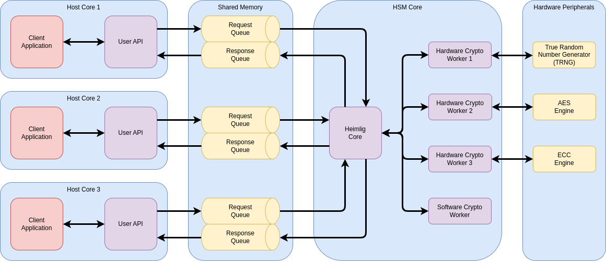

# Sindri

Sindri is a
[Hardware Security Module (HSM)](https://en.wikipedia.org/wiki/Hardware_security_module)
firmware for
[embedded platforms](https://docs.rust-embedded.org/book/intro/no-std.html)
written in Rust.

Sindri typically runs on dedicated hardware and provides cryptographic services to clients running
on other cores.
These include:

- Generation and secure storage of cryptographic keys.
- Key use (encryption, decryption, signing, verification) without revealing key material to the
client.
- Generation of cryptographically secure random numbers
  ([CSPRNG](https://en.wikipedia.org/wiki/Cryptographically_secure_pseudorandom_number_generator)).

## Status

__Warning: Sindri is still under development and is not production ready__.

Sindri implements common cryptographic algorithms:

- Symmetric encryption and decryption
  ([AES-CBC](https://en.wikipedia.org/wiki/Block_cipher_mode_of_operation#Cipher_block_chaining_(CBC)),
   [AES-GCM](https://en.wikipedia.org/wiki/Block_cipher_mode_of_operation#Galois/counter_(GCM)),
   [AES-CCM](https://en.wikipedia.org/wiki/Block_cipher_mode_of_operation#Counter_with_cipher_block_chaining_message_authentication_code_(CCM)),
   [Chacha20Poly1305](https://en.wikipedia.org/wiki/ChaCha20-Poly1305))
- Signing and verification
  ([ECDSA](https://en.wikipedia.org/wiki/Elliptic_Curve_Digital_Signature_Algorithm))
- Key exchange
  ([ECDH](https://en.wikipedia.org/wiki/Elliptic-curve_Diffie%E2%80%93Hellman))
- Hashing
  ([SHA-2](https://en.wikipedia.org/wiki/SHA-2),
   [SHA-3](https://en.wikipedia.org/wiki/SHA-3))
- Random number generation
  ([ChaCha20Rng](https://docs.rs/rand_chacha/latest/rand_chacha/struct.ChaCha20Rng.html))

Current main limitations include:

- Most cryptographic algorithms are implemented in software only.
- Persistent storage for key material is missing.
- The code has not been independently audited by security experts.

An
[example implementation](examples/stm32h745i/README.md)
is available for the
[STM32H745XI](https://www.st.com/en/evaluation-tools/stm32h745i-disco.html)
discovery board as well as for
[Linux](examples/linux/README.md)
(for development).

## Quickstart

### Linux Example

The fastest way to see Sindri working is to run the
[Linux example](examples/linux/README.md):

```bash
cd examples/linux
cargo run
```

Example output:

```output
    Finished dev [unoptimized + debuginfo] target(s) in 0.07s
     Running `target/debug/linux`
2022-11-24T13:30:19.419Z INFO  [CLIENT] Sending request: random data (size=16)
2022-11-24T13:30:19.429Z INFO  [CLIENT] Received response: random data (size=16): 2831804f4db41f98b2fe24bdde36372f
```

The example instantiates a Sindri core and a client.
Both communicate via two
[heapless queues](https://docs.rs/heapless/latest/heapless/spsc/struct.Queue.html).
One for requests to the core and one for responses from it.
The client continuously requests random numbers from the core and prints the results to the console.

### Hardware Example

See the
[STM32H745I example](examples/stm32h745i/README.md).

## Architecture

Sindri is intended to run on a dedicated microprocessor with access to an exclusive memory region.
Neither Sindri nor any of its dependencies need an allocator or use the Rust standard library
([no_std](https://docs.rust-embedded.org/book/intro/no-std.html)).



The core of Sindri consists of a scheduler that accepts requests from clients and schedules these
requests to different workers.
These workers can be implemented in software or in hardware.
Once a result is ready, the core sends it back to the client in a response.

Communication between the different clients and the core is typically done via shared memory queues
(based on
[heapless queues](https://docs.rs/heapless/latest/heapless/spsc/struct.Queue.html)).
This approach can be found in the
[Linux example](examples/linux/README.md).
However, this is just one implementation of the more general communication interface Sindri assumes.
Custom hardware-specific mechanisms can be used as well.

This architecture makes it possible to run most of the cryptographic algorithms in software and
later switch individual workers to hardware implementations.

It is also possible to run Sindri alongside other applications on the same microprocessor.
This has implications on the security requirements regarding the applications running alongside
Sindri as they have access to internals of the HSM.
Nevertheless, such a setup can be useful if the security requirements of the project allow for it.

## Integration

To add Sindri to a project, several hardware-specific components have to be provided.
These include:

- Communication channels between clients and the Sindri core.
- An instance of a memory `Pool`.
This usually requires a statically allocated memory region.
- An entropy source to instantiate a random number generator (`Rng`) instance.
- Optionally a key store that implements the `KeyStore` interface.
A RAM-based `MemoryKeyStore` is provided for testing purposes.
If no key store is provided, necessary keys must be sent by the clients as part of their requests.

The integrator can then go on to instantiate a `hsm::Core` on the HSM side
and one or more `client::Api` instances for the different clients.
Instantiating these structs requires the previously mentioned components.

## Contributing

Contributions are very welcome.
Feel free to file issues and create pull requests here on GitHub.

## License

Sindri is dual-licensed under the
[Apache 2.0](LICENSE-APACHE.txt)
and
[MIT](LICENSE-MIT.txt)
licenses.
