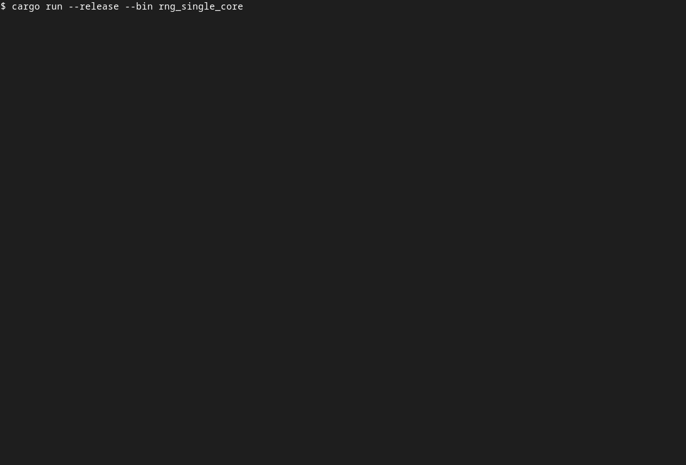

# Heimlig

Heimlig is a [Hardware Security Module
(HSM)](https://en.wikipedia.org/wiki/Hardware_security_module) firmware for [embedded
platforms](https://docs.rust-embedded.org/book/intro/no-std.html) written in Rust.



## Table of Contents

- [About](#about)
- [Status](#status)
- [Quickstart](#quickstart)
  - [Linux Example](#linux-example)
  - [Hardware Example](#hardware-example)
- [Architecture](#architecture)
- [Integration](#integration)
- [Contributing](#contributing)
- [License](#license)

## About

As an [HSM](https://en.wikipedia.org/wiki/Hardware_security_module), Heimlig typically runs on
dedicated hardware and provides cryptographic services to clients running on other cores. These
include:

- Generation and secure storage of cryptographic keys.
- Key use (encryption, decryption, signing, verification) without revealing key material to the
client.
- Generation of cryptographically secure random numbers
  ([CSPRNG](https://en.wikipedia.org/wiki/Cryptographically_secure_pseudorandom_number_generator)).

## Status

Heimlig implements common cryptographic algorithms as software workers:

- Symmetric encryption and decryption
  ([AES-CBC](https://en.wikipedia.org/wiki/Block_cipher_mode_of_operation#Cipher_block_chaining_(CBC)),
   [AES-GCM](https://en.wikipedia.org/wiki/Block_cipher_mode_of_operation#Galois/counter_(GCM)),
   [AES-CCM](https://en.wikipedia.org/wiki/Block_cipher_mode_of_operation#Counter_with_cipher_block_chaining_message_authentication_code_(CCM)),
   [Chacha20Poly1305](https://en.wikipedia.org/wiki/ChaCha20-Poly1305))
- Signing and verification
  ([ECDSA](https://en.wikipedia.org/wiki/Elliptic_Curve_Digital_Signature_Algorithm))
- Key exchange ([ECDH](https://en.wikipedia.org/wiki/Elliptic-curve_Diffie%E2%80%93Hellman))
- Hashing ([SHA-2](https://en.wikipedia.org/wiki/SHA-2),
  [SHA-3](https://en.wikipedia.org/wiki/SHA-3),
   [BLAKE3](https://en.wikipedia.org/wiki/BLAKE_(hash_function)#BLAKE3))
- Random number generation
  ([ChaCha20Rng](https://docs.rs/rand_chacha/latest/rand_chacha/struct.ChaCha20Rng.html))

An [example implementation](examples/stm32h745i/README.md) is available for the
[STM32H745XI](https://www.st.com/en/evaluation-tools/stm32h745i-disco.html) discovery board as well
as for [Linux](examples/linux/README.md) (for development).

The code has not yet been independently audited by security experts.

## Deployment

To deploy Heimlig in a bare-metal environment, additional integration with the hardware is required:

- Chip bring-up and peripheral access
- Async executor (such as [embassy-executor](https://crates.io/crates/embassy-executor))
- Hardware-specific workers for persistent key storage and hardware-accelerated cryptography.
  The provided software workers can be used where hardware acceleration is not required.

## Quickstart

### Linux Example

The fastest way to see Heimlig working is to run the [Linux example](examples/linux/README.md):

```bash
cd examples/linux
cargo run
```

Example output:

```output
    Finished dev [unoptimized + debuginfo] target(s) in 0.07s
     Running `target/debug/linux`
2022-11-24T13:30:19.419Z INFO  [CLIENT] Sending request: random data (size=16)
2022-11-24T13:30:19.429Z INFO  [CLIENT] Received response: random data (size=16): 2831804f4db41f98b2fe24bdde36372f
```

The example instantiates a Heimlig core and a client. Both communicate via two [heapless
queues](https://docs.rs/heapless/latest/heapless/spsc/struct.Queue.html). One for requests to the
core and one for responses from it. The client continuously requests random numbers from the core
and prints the results to the console.

### Hardware Example

See the [STM32H745I example](examples/stm32h745i/README.md).

## Architecture


Heimlig consists of three main components: The host-side client API, the Heimlig core and the crypto
workers. These three groups communicate by sending request-response pairs over hardware-specific
message queues.

The core accepts requests from the client API and schedules them to different workers. Workers use
the HSM CPU and can utilize hardware acceleration if available. Once a response is ready, it is sent
back to the client via the core. This architecture makes it possible to run most of the
cryptographic algorithms in software and later switch individual workers to use hardware
acceleration.

While Heimlig is designed to run on dedicated hardware, it is possible to integrate it alongside
other security applications that are running on the same microprocessor. This has implications on
the provided security level as any code running alongside Heimlig has access to its internals.
Nevertheless, such a setup can be useful if the security requirements of the project allow for it.

See [Architecture.md](doc/Architecture.md) for more details.

## Integration

To add Heimlig to a project, several hardware-specific components have to be provided. These
include:

- Communication channels between clients and the Heimlig core.
- An instance of a memory `Pool`. This usually requires a statically allocated memory region.
- An entropy source to instantiate a random number generator (`Rng`) instance.
- Optionally a key store that implements the `KeyStore` interface. A RAM-based `MemoryKeyStore` is
provided for testing purposes. If no key store is provided, necessary keys must be sent by the
clients as part of their requests.

The integrator can then go on to instantiate a `hsm::Core` on the HSM side and one or more
`client::Api` instances for the different clients. Instantiating these structs requires the
previously mentioned components.

## Contributing

Contributions are very welcome. Feel free to file issues and create pull requests here on GitHub.

## License

Heimlig is dual-licensed under the [Apache 2.0](LICENSE-APACHE.txt) and [MIT](LICENSE-MIT.txt)
licenses.
