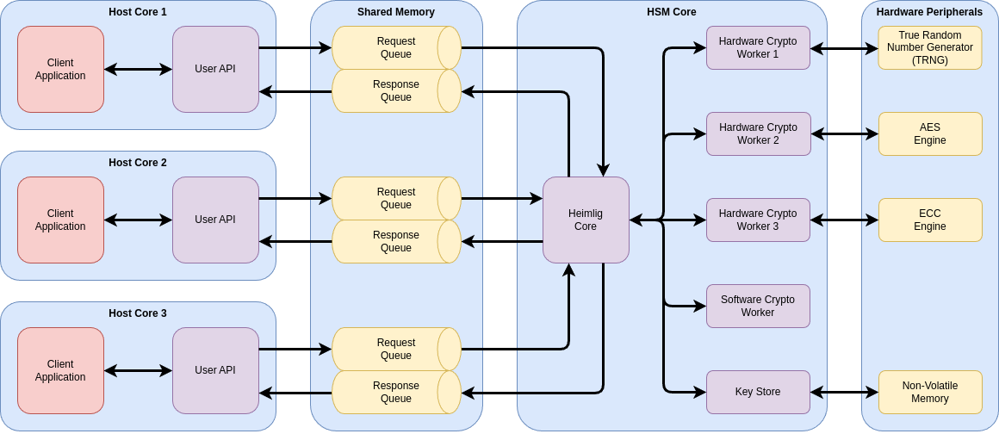

# Architecture

## Overview

Internally, Heimlig works by process requests for cryptographic work and returning corresponding
responses. Every request must be answered by exactly on response that contains the result or an
error. These requests-responses pairs are exchanged between three main component groups:

1. The HSM API running on the host cores where client applications are located.
2. The Heimlig core running on the HSM core that handles incoming requests and outgoing responses.
3. The crypto workers that do the actual cryptographic work. Both hardware-specific workers and
   software-only workers that run on the HSM core are possible.

These component groups are connected with hardware-specific queues to communicate with one another.

## Communication

The flow of request-response pairs is as follows:

- A client application running on a host core calls the HSM API to do some cryptographic work.
- The host-side API generates a request message and adds it to the queue leading to the Heimlig
  core.
- The core receives the requests, checks if for validity and forwards it to the corresponding crypto
  worker via the queue to that worker.
- The crypto worker accepts the requests, processes the desired cryptographic operation and returns
  it to the core.
- The core receives the response and forwards it to the client that sent the original request.
- The host-side API receives the response and either copies the received data to the application or
  returns an error to it.

## Allocation

Heimlig is a [`no_std`](https://docs.rust-embedded.org/book/intro/no-std.html) crate, meaning it
does not use the heap or use the Rust standard library. For stack allocations, Heimlig requires a
exclusive protected memory region.

For data that is referenced in requests and responses, memory is usually allocated in a shared
memory region that is visible from both the host and the HSM cores. To prevent data races between
these cores, allocating and deallocating are done by the host only. This means that the memory that might be required by a non-error response is already allocated when the request is generated.

If a client calls the API on the host, the API allocates memory from the shared memory region and
copies data from the client to it. References to the allocated memory are then handed over to the
Heimlig core as part of the crypto request. Until the corresponding response arrives, the allocated
memory is under exclusive control of the HSM core. Once the response does arrive, the results are
copied back to the client and the memory is deallocated.

## Multi Tasking

Heimlig uses the standard Rust async/await mechanism to efficiently process incoming requests. This
means that both the core as well as each individual crypto worker can run in separate system tasks.
For example,
[`embassy_executor::task`](https://docs.embassy.dev/embassy-executor/git/cortex-m/attr.task.html)
can be used for this purpose. Synchronization between different tasks is done by communicating via
single producer single consumer queues like
[`embassy_sync::channel`](https://docs.embassy.dev/embassy-sync/git/default/channel/index.html) or
[`heapless::spsc::Queue`](https://docs.rs/heapless/latest/heapless/spsc/index.html).

## Separation Heimlig and Integration Code

As a low-level component, Heimlig consists of both hardware-independent and -dependent parts. Where
possible, interfacing with hardware-dependent parts is modelled with traits that then have to be
implemented by an integrator. Alternatively, an implementation from the examples or from an external
crate such as [Embassy](https://embassy.dev/) can be used.

Hardware-dependent components of Heimlig include:

- Async-executor and tasks (e.g.
  [embassy-executor](https://docs.embassy.dev/embassy-executor/git/cortex-m/index.html))
- Queues to transmit requests and responses (e.g.
  [embassy-sync](https://docs.embassy.dev/embassy-sync/git/default/index.html) or
  [heapless](https://docs.rs/heapless/latest/heapless/))
